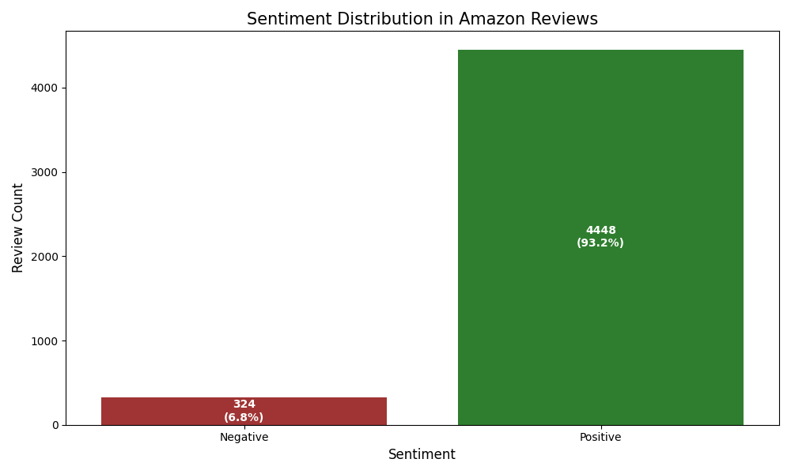
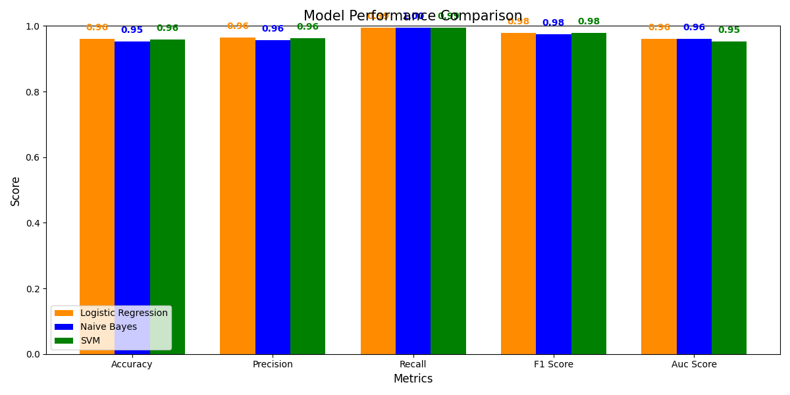
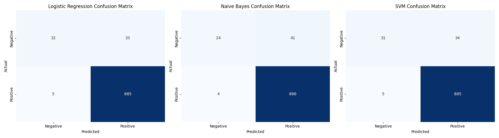
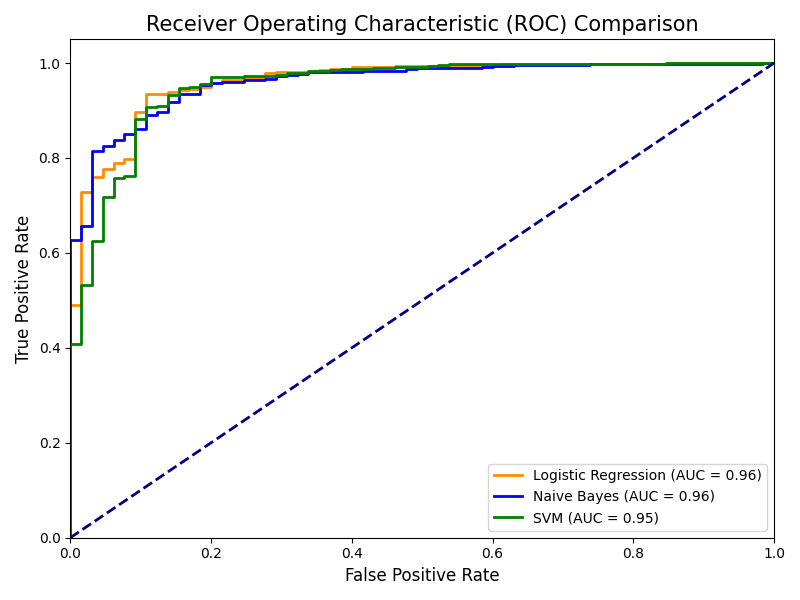

# DS680: (Natural Language Processing) Amazon Sentiment Analysis

*By Carlos Segarra*

This project uses traditional supervised machine learning methods to analyze sentiment in Amazon product reviews, establishing a reliable performance baseline through a comprehensive evaluation of three classification models.

## Overview

The pipeline processes 4,772 Amazon reviews using standard natural language processing (NLP) techniques, including tokenization, stopword removal, lemmatization, and TF-IDF vectorization. Three classifiers are trained and evaluated with hyperparameter tuning via grid search:

- **Logistic Regression** (Best performing: F1-score 0.9790, AUC 0.9611)
- **Multinomial Naive Bayes**
- **Support Vector Machine**

The dataset exhibits significant class imbalance with 93.2% positive and 6.8% negative reviews. Despite this challenge, all models achieve strong performance metrics through careful tuning and evaluation.

**Dataset Source**: [Amazon Reviews for Sentiment Analysis](https://www.kaggle.com/datasets/tarkkaanko/amazon) on Kaggle

## Research Paper

This project is based on academic research in sentiment analysis using traditional machine learning approaches. The complete methodology, results, and analysis are documented in the accompanying research paper.

📄 **[Read the full research paper](docs/Segarra_Amazon_Sentiment_Analysis.pdf)**

## Results

| Model               | Accuracy | Precision | Recall | F1-Score   | AUC    |
| ------------------- | -------- | --------- | ------ | ---------- | ------ |
| Logistic Regression | 96.02%   | 96.41%    | 99.44% | **0.9790** | 0.9611 |
| Naive Bayes         | 95.29%   | 96.19%    | 99.21% | 0.9752     | 0.9600 |
| SVM                 | 95.92%   | 96.35%    | 99.33% | 0.9784     | 0.9518 |

## Quick Start

### Prerequisites

- Python 3.7+
- Kaggle account for dataset access

### Installation

1. **Clone the repository**
   ```bash
   git clone https://github.com/yourusername/amazon-sentiment-analysis.git
   cd amazon-sentiment-analysis
   ```

2. **Install dependencies**
   ```bash
   pip install -r requirements.txt
   ```

3. **Set up Kaggle API authentication**

   To use the Kaggle API, sign up for a Kaggle account at https://www.kaggle.com. Then go to the 'Account' tab of your user profile (`https://www.kaggle.com/<username>/account`) and select 'Create API Token'. This will trigger the download of `kaggle.json`, a file containing your API credentials. Place this file in the location appropriate for your operating system:

   - **Linux**: `$XDG_CONFIG_HOME/kaggle/kaggle.json` (defaults to `~/.config/kaggle/kaggle.json`). The path `~/.kaggle/kaggle.json`, which was used by older versions of the tool, is also still supported.
   - **Windows**: `C:\Users\<Windows-username>\.kaggle\kaggle.json` - you can check the exact location, sans drive, with `echo %HOMEPATH%`.
   - **Other**: `~/.kaggle/kaggle.json`

4. **Run the analysis**
   ```bash
   python main.py
   ```

## Project Structure

```mint
amazon-sentiment-analysis/
├── README.md
├── requirements.txt
├── main.py                    # Entry point for the analysis
├── config/
│   ├── __init__.py
│   └── settings.py           # Pydantic configuration
├── src/
│   ├── __init__.py
│   ├── data/
│   │   ├── __init__.py
│   │   ├── loader.py         # Dataset loading from Kaggle
│   │   └── preprocessor.py   # Text preprocessing & TF-IDF
│   ├── models/
│   │   ├── __init__.py
│   │   └── schemas.py        # Pydantic data models
│   ├── training/
│   │   ├── __init__.py
│   │   ├── models.py         # ML model classes
│   │   └── evaluator.py      # Model evaluation
│   ├── utils/
│   │   ├── __init__.py
│   │   └── helpers.py        # Utility functions
│   └── visualization/
│       ├── __init__.py
│       └── plots.py          # Plotting functions
└── output/
    └── plots/                # Generated visualizations
```

## Generated Outputs

The pipeline produces several visualizations in `output/plots/`:

### Sentiment Distribution



### Model Performance Comparison



### Confusion Matrices



### ROC Curves



## Technical Details

### Text Preprocessing

- Lowercasing and HTML tag removal
- Non-alphabetic character filtering
- NLTK tokenization and stopword removal
- WordNet lemmatization
- TF-IDF vectorization (max_features=10000, min_df=5)

### Model Training

- **Logistic Regression**: Grid search over C=[0.1, 1.0, 10.0], solvers=['liblinear', 'saga']
- **Naive Bayes**: Alpha tuning [0.01, 0.1, 0.5, 1.0]
- **SVM**: Linear kernel with C=[0.1, 1.0, 10.0]
- 3-fold cross-validation for hyperparameter optimization

### Evaluation Metrics

- Accuracy, Precision, Recall, F1-Score
- Area Under ROC Curve (AUC)
- Confusion matrices for detailed analysis
